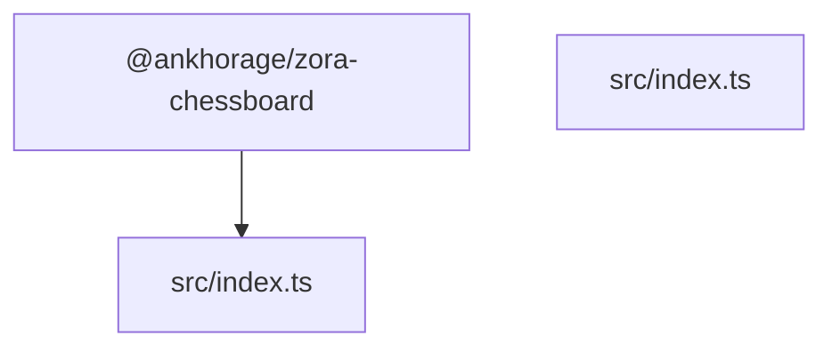

<!-- markdownlint-disable MD013 MD033 -->
<!-- This file is generated by Paradox. Do not edit manually. -->

# @ankhorage/zora-chessboard

        

Chessboard component for React Native and React Native Web apps built on ZORA.

## Generated documentation

- [Interactive documentation app](././paradox/index.html)
- [Public API reference](././paradox/exports.md)
- [Component registry](././paradox/components.md)
- [Architecture overview](././paradox/diagrams/architecture-overview.mmd)
- [Module relationships](././paradox/diagrams/module-relationships.mmd)
- [Export graph](././paradox/diagrams/export-graph.mmd)

## Architecture preview

Architecture overview

